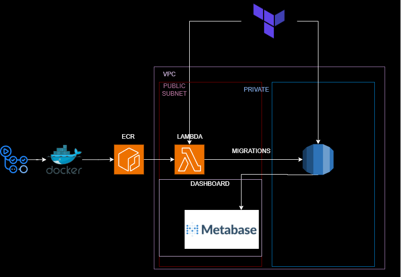

## Why?
As a data engineer, we cannot imagine our life without a database at this point. We plan our data
schema, and proceed to create it, for a while life is wonderful and nothing is required from us.
As we approach to the expiry date, the update is inevitable. But how we gonna do it? 
Is it enough to create schemas using cli, or a tool such as Dbeaver to run a few sql scripts
manually. Got what we desired and call it a day? I'd say maybe 20 years ago it was the case,
it is not most definitely now. You need to keep track of the changes you've made. Well it is possible
to create a new .docx file and throw the lines of the sql there so you can see the changes, though
it is not fancy, and fancy is what we do here. Jokes aside, maybe you've decided to use a tool alembic
to automatically run the migrations with versioning. Awesome choice, so let's go and desing our
postgres database which we are going to run on the cloud.

## High-level architecture
As you can see from the image, we are using terraform to provision our infrastructure on aws. Terraform will create the 
RDS Postgres, Lambda function, required role-policies, VPC, subnets and many more. The important thing is here to know 
what can be done by Terraform and what cannot.


### Why we need lambda to do migrations?
Well since the RDS Postgres will be placed in a private subnet
meaning there will be no access from internet to our database as it should be, in order to communicate
we need trigger something that can be run as soon as the new migration has been added to the github repo,
and the workflow started. I've decided to use lambda since the migrations is unlikely to take more than 
15 minutes in my case, and I was wondering how to make custom lambda images using dockerfiles.

### How does it work?
#### Locally
First we need to run the command to start our postgres database and metabase.

`docker compose up` command will start a local Postgres@14.5 instance available for later use,
as well as a metabase. 
```yaml
services:
  postgres:
    image: postgres:14.5
    ports:
      - 54325:5432
    environment:
      - POSTGRES_PASSWORD=hzlocslocs
      - POSTGRES_USER=hzlocslocs
      - POSTGRES_DB=hzlocslocs

  metabase:
    image: metabase/metabase
    ports:
      - "3000:3000"
    container_name: metabase
    depends_on:
      - postgres
```

This image will perform the migrations as soon as a request send to the lambda function. The
request can be sent to the lambda function as soon as we've updated the function image.
the **lambda_function.py** file will be the entrypoint in our dockerfile.
```python
import sys
import alembic.command
import alembic.config

def migrate():
    alembic_argvs = [
    '--raiseerr',
    'upgrade', 'head',
    ]
    alembic.config.main(argv=alembic_argvs)

def handler(event, context):
    migrate()
```
and the dockerfile which will export the DB_URL environment variable based on the args 
which is going to be fed into docker build. This is not **recommended** method of providing the 
secrets to the docker, should not be used in production environment.

 ```dockerfile
FROM public.ecr.aws/lambda/python:3.12

# set DB connection string
ARG DB_HOST=tf-postgres-aws-postgres-1
ARG DB_USERNAME=hzlocslocs
ARG DB_PASSWORD=hzlocslocs
ARG DB_NAME=hzlocslocs
ARG DB_PORT=5432

ENV DB_URL="postgresql+psycopg2://$DB_USERNAME:$DB_PASSWORD@$DB_HOST:$DB_PORT/$DB_NAME"

# Copy requirements.txt
COPY requirements.txt alembic.ini ${LAMBDA_TASK_ROOT}
COPY migration ${LAMBDA_TASK_ROOT}/migration

# Install the specified packages
RUN pip install -r requirements.txt

# Copy function code
COPY lambda_function.py ${LAMBDA_TASK_ROOT}

# Set the CMD to your handler (could also be done as a parameter override outside of the Dockerfile)
CMD [ "lambda_function.handler" ]
```
we will build our dockerfile by using commands:
```shell
docker build --platform linux/amd64 -t docker-image:test .
```
After the build is ready we need to run the docker image by using command. One caveat is here to make sure
our postgres database and the container we will be running is on the same network. 
Otherwise the connection won't be established, and the migration will be unsuccessful. 
Find the name of the network postgres is running, usually it's enough to just inspect container,
then add the network name instead of the placeholder. 
```shell
docker run --platform linux/amd64 --network <<POSTGRES NETWORK NAME>> -p 9000:8080 docker-image:test
```
Well the last thing is to send a request to the lambda to run the migrations. This command will run the 
lambda function, and as well as the outputs of the migration.
```shell
curl "http://localhost:9000/2015-03-31/functions/function/invocations" -d '{}'
```
Well done, now you did migrations using lambda on your local machine. 
I will be explaining the later in a different post.

---
All the code can be reviewed on the [repo](https://github.com/hzloc/tf-postgres-automated-db-control)
> :warning: **not suitable to be used in prod environment** 
