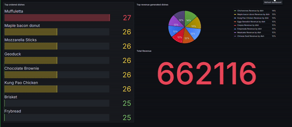

# Real-time analytics
## Idea
Whenever, I eat in a fastfood restaurant I've always wondered what if there would be a statistics of the orders such as most popular menus, or drinks, next to the
order collection dashboard. While it is hundred percent unnecessary though it would be fun idea to see what is going on while you are waiting on your food to be prepared.
I am a big fun of the whoppers 🍔, and I've always wanted to see is that most popular choice among people? 

Well it's well definitely possible to do so, in fact, we gonna do our dashboard!

# Tech-stack
We are going to use 
- **postgresql** to store the orders, restaurants, dishes, as well as drinks
- **mimesis** to create fake dishes, drinks, restaurants, orders
- **apache** kafka to create fake orders as well as consume fake orders
- **grafana** to see the changes in real-time

Please check the github repo [realtime-order-analytics](https://github.com/hzloc/restaurant-realtime-dashboard/tree/main)
to see how to build it on your local machine, and run for repeating the project.

The most important things that made me to choose **grafana** was how easy to reproduce the dashboards using **json** build files.
Without doing anything, we will see the same dashboard since everything can be provisioned in build time, and this is a huge advantage,
especially when you want to share the ready solution for people to try effortlessly!

## Final results
Below you can see the end product

> :warning: This is not a production grade solution, rather an experiment project
